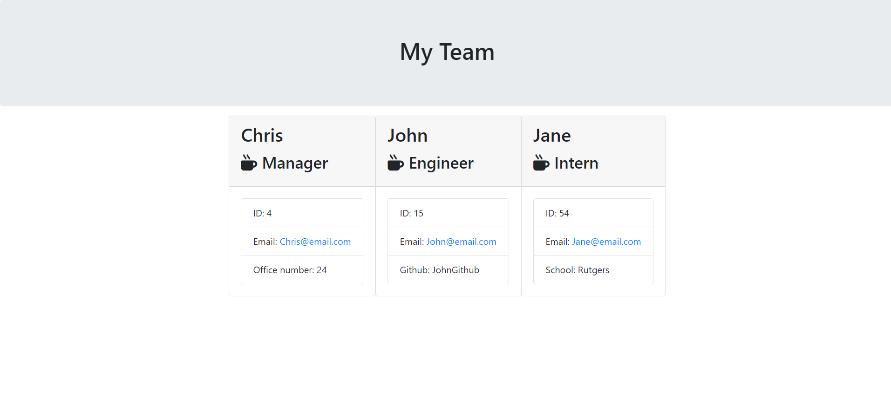

# Team-Profile-Generator

  

  ## Table of Contents
  - [Description](#Description)
  - [Installation](#Installation)
  - [Usage](#Usage)
  - [Demonstration](#Demonstration)
  - [Tests](#Tests)
  - [License](#License)
  - [Questions](#Questions)

  ## Screenshot
  

  ## Description
  This project allows you to generate a team through the terminal, creating a manager, then adding engineers and interns to the team, complete with their emails, id's, and information important to each role. This then generates a new page which generates cards that displays each team member with the inputted information.

  ## Installation
  Open the project in the terminal, then type npm i, npm i inquirer, and npm i jest.

  ## Usage
  Open the project in the terminal, then type node index.js. Follow the prompts until all members of the team are generated, then open the website from the generated HTML file in the output folder.

  ## Demonstration

  ## Tests

  ## License
  
   
  This application uses no license.

  ## Questions
  You can contact me for questions at my [email](mailto:cwishart203@gmail.com), or you can go to my [GitHub](https://github.com/cwishart203).

  ## Addtional Contributors
  N/A
